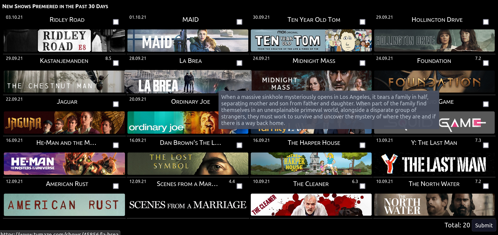

# TVmaze Shows CRUD

## Introduction
A sample code of the use of TVmaze API implementation.

## Dependencies
- PHP server
- MySQL Database Server
- TheTVDB API ID
- Imgur API ID

## Usage
Make sure to set your API credentials before usage. If the banner is missing you'll have the option to add it.

